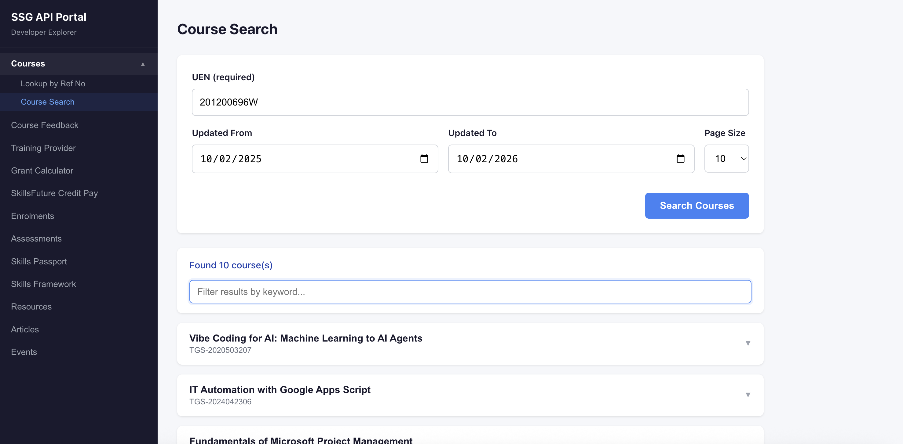

<div align="center">

# SSG API Portal

[](https://nodejs.org/)
[](https://react.dev/)
[](https://www.typescriptlang.org/)
[](https://expressjs.com/)
[](https://vite.dev/)
[](https://ssg-api-portal.vercel.app)
[](LICENSE)

**A developer tool for exploring SkillsFuture Singapore (SSG-WSG) APIs**

[Live Demo](https://ssg-api-portal.vercel.app) · [Report Bug](https://github.com/alfredang/ssg-api-portal/issues) · [Request Feature](https://github.com/alfredang/ssg-api-portal/issues)

</div>

## Screenshot



## About

SSG API Portal is a React web app for exploring the SSG-WSG (SkillsFuture Singapore) APIs. It provides a clean interface for looking up course details by reference number, searching courses by UEN and keyword, and viewing training provider information — all powered by OAuth 2.0 and mTLS certificate authentication via an Express backend proxy.

### Key Features

| Feature | Description |
|---------|-------------|
| **Course Lookup** | Search by course reference number |
| **Course Search** | Search by UEN, keyword, and date range with filtering |
| **Courses by TP UEN** | Retrieve all courses for a training provider by UEN |
| **Course Details** | View course overview, objectives, cost, and duration |
| **Course Feedback** | Retrieve course quality and outcome ratings |
| **Training Providers** | Course sessions, attendance, publish/edit course runs, trainer management |
| **Grant Calculator** | Baseline scheme, personalised grants, search and view grants |
| **SkillsFuture Credit Pay** | View/cancel claims, upload docs, encrypt/decrypt requests |
| **Enrolments** | Create, update, search, view enrolments and fee collections |
| **Assessments** | Create, update/void, search, view assessments |
| **Skills Passport** | Retrieve qualification codes |
| **SEA** | Skill extraction and skill search APIs |
| **Skills Framework** | Job role details and skills details lookup |
| **Tools** | Generate certificates, RSA keypairs, and encryption keys |
| **Default Values** | Centrally configure common fields (UEN, Course Ref, NRIC, etc.) that auto-populate all forms |
| **Known API Issues** | Collapsible dashboard grouped by category with error counts and references |
| **Dual Auth** | OAuth 2.0 for public APIs + mTLS certificates for registry APIs |

## Tech Stack

| Category | Technology |
|----------|------------|
| **Frontend** | React 19, TypeScript 5.9, Vite 7 |
| **Backend** | Express 5, Node.js 22 |
| **Authentication** | OAuth 2.0 (client credentials) + mTLS (client certificates) |
| **APIs** | SSG-WSG Course, Grant, SF Credit, Enrolment, Assessment, Skills Passport, SEA, Skills Framework APIs |
| **Deployment** | Vercel (serverless functions + static hosting) |
| **HTTP Client** | Axios (frontend), native `https` (backend mTLS) |

## Architecture

```
┌──────────────────────────────────────────────────────────────────┐
│                        Browser (React)                          │
│                     Vite + TypeScript SPA                       │
└───────────────────────────┬──────────────────────────────────────┘
                            │
                    /api/courses/*
                            │
┌───────────────────────────▼──────────────────────────────────────┐
│                     Express Proxy Server                         │
│                                                                  │
│  ┌─────────────────────┐    ┌──────────────────────────────────┐ │
│  │   OAuth Module       │    │   mTLS Module                    │ │
│  │   (client_credentials│    │   (client certificate + key)     │ │
│  │    grant + cache)    │    │                                  │ │
│  └──────────┬──────────┘    └──────────────┬───────────────────┘ │
└─────────────┼──────────────────────────────┼─────────────────────┘
              │                              │
              ▼                              ▼
┌─────────────────────────┐  ┌──────────────────────────────────┐
│  public-api.ssg-wsg.sg  │  │       api.ssg-wsg.sg             │
│  Course Directory v1.2  │  │  Course Registry/Search v8.0     │
│  (OAuth Bearer Token)   │  │  (mTLS Certificate Auth)         │
└─────────────────────────┘  └──────────────────────────────────┘
```

## Project Structure

```
ssg-api-portal/
├── api/
│   └── index.js              # Vercel serverless entry point
├── server/
│   ├── index.js              # Express app (entry point + export)
│   ├── oauth.js              # OAuth token fetch + cache
│   └── proxy.js              # API proxy routes (OAuth + mTLS)
├── client/
│   ├── index.html            # HTML entry point
│   ├── vite.config.ts        # Vite configuration
│   └── src/
│       ├── App.tsx           # Main app orchestrator
│       ├── App.css           # Application styles
│       ├── api/
│       │   └── courseApi.ts  # API client functions
│       ├── components/
│       │   ├── SearchForm.tsx         # Course lookup form
│       │   ├── CourseSearchForm.tsx    # Course search form
│       │   ├── CourseOverview.tsx      # Course details display
│       │   ├── CourseMetadata.tsx      # Metadata tags
│       │   ├── CourseRunsTable.tsx     # Course runs table
│       │   └── TrainingProviderCard.tsx # Provider details
│       ├── hooks/
│       │   └── useApi.ts    # Generic API hook
│       └── types/
│           └── course.ts    # TypeScript interfaces
├── default-values.csv        # Default form values (UEN, Course Ref, etc.)
├── vercel.json               # Vercel deployment config
├── package.json              # Root dependencies
└── .env.example              # Environment variable template
```

## Getting Started

### Prerequisites

- [Node.js](https://nodejs.org/) 18+
- SSG Developer Portal account with OAuth credentials ([register here](https://developer.ssg-wsg.gov.sg))
- mTLS client certificate and private key (for Course Search API)

### Installation

```bash
# Clone the repository
git clone https://github.com/alfredang/ssg-api-portal.git
cd ssg-api-portal

# Install dependencies
npm install
cd client && npm install && cd ..

# Configure environment
cp .env.example .env
```

Edit `.env` with your SSG credentials:

```env
# OAuth Authentication (public-api.ssg-wsg.sg)
SSG_API_BASE_URL=https://public-api.ssg-wsg.sg
SSG_CLIENT_ID=your_client_id
SSG_CLIENT_SECRET=your_client_secret

# mTLS Authentication (api.ssg-wsg.sg)
SSG_CERT_API_BASE_URL=https://api.ssg-wsg.sg
CERT_PATH=./server/.cert/your_cert.pem
CERT_KEY_PATH=./server/.cert/your_key.pem
```

### Running Locally

```bash
npm run dev
```

Starts Express on http://localhost:3001 and Vite on http://localhost:5173.

### Production Build

```bash
npm run build
npm start
```

Builds the React app and serves everything from Express on port 3001.

## Deployment

### Vercel

The app is configured for Vercel with serverless functions. The Express API runs as a serverless function and the React SPA is served as static files.

```bash
# Install Vercel CLI
npm i -g vercel

# Deploy
vercel --prod
```

**Required environment variables on Vercel:**

| Variable | Description |
|----------|-------------|
| `SSG_CLIENT_ID` | OAuth client ID |
| `SSG_CLIENT_SECRET` | OAuth client secret |
| `SSG_API_BASE_URL` | Public API base URL |
| `SSG_CERT_API_BASE_URL` | Certificate API base URL |
| `CERT_PEM_BASE64` | Base64-encoded client certificate |
| `CERT_KEY_PEM_BASE64` | Base64-encoded private key |
| `CERT_ENCRYPTION_KEY` | AES-256 encryption key |

## API Reference

This app proxies requests to SSG-WSG production APIs with cert-first + OAuth fallback:

| Endpoint | Method | Version | Description |
|----------|--------|---------|-------------|
| `/api/courses/:refNo` | GET | v1.2 | Lookup course by reference number |
| `/api/courses/details/:refNo` | GET | v8.0 | Get detailed course information |
| `/api/courses/search` | POST | v8.0 | Search courses by UEN, keyword, date range |
| `/api/training-providers/:uen/courses` | GET | v8.0 | Courses by training provider UEN |
| `/api/courses/:refNo/quality` | GET | v2.0 | Course quality ratings |
| `/api/courses/:refNo/outcome` | GET | v2.0 | Course outcome ratings |
| `/api/courses/runs/:runId/sessions` | GET | v1.5 | Course sessions |
| `/api/courses/runs/:runId/sessions/attendance` | GET | v1.5 | Session attendance |
| `/api/courses/runs/:runId/sessions/attendance/upload` | POST | v1.5 | Upload session attendance |
| `/api/courses/courseRuns/publish` | POST | v1.0 | Publish course run |
| `/api/courses/courseRuns/edit/:runId` | POST | v1.0 | Update/delete course run |
| `/api/courses/courseRuns/id/:runId` | GET | v1.0 | Course run by ID |
| `/api/courses/courseRuns/reference` | GET | v1.0 | Course runs by reference |
| `/api/training-providers/:uen/trainers` | GET | v2.0 | Trainer details |
| `/api/training-providers/:uen/trainers/:id` | POST | v2.0 | Update/delete trainer |
| `/api/grants/baseline` | POST | v3.0 | Grant calculator — baseline |
| `/api/grants/personalised` | POST | v3.0 | Grant calculator — personalised |
| `/api/grants/search` | POST | v1.0 | Search grants |
| `/api/grants/details/:grantRefNo` | GET | v1 | View grant details |
| `/api/grants/codes/fundingComponent` | GET | v1 | Grants code lookup |
| `/api/sf-credits/claims/:claimId` | GET | v2 | View SF credit claim |
| `/api/sf-credits/claims/:claimId/cancel` | POST | v2 | Cancel SF credit claim |
| `/api/sf-credits/claims/:claimId/supportingdocuments` | POST | v2 | Upload supporting docs |
| `/api/sf-credits/claims/encryptRequests` | POST | v2 | Encrypt claim request |
| `/api/sf-credits/claims/decryptRequests` | POST | v2 | Decrypt claim request |
| `/api/enrolments` | POST | v3.0 | Create enrolment |
| `/api/enrolments/details/:refNo` | GET/POST | v3.0 | View/Update enrolment |
| `/api/enrolments/search` | POST | v3.0 | Search enrolments |
| `/api/enrolments/feeCollections/:refNo` | POST | v3.0 | Update fee collection |
| `/api/enrolments/codes/sponsorshipType` | GET | v3.0 | Enrolment code lookup |
| `/api/assessments` | POST | v1 | Create assessment |
| `/api/assessments/details/:refNo` | GET/POST | v1 | View/Update assessment |
| `/api/assessments/search` | POST | v1 | Search assessments |
| `/api/assessments/codes/idType` | GET | v1 | Assessment code lookup |
| `/api/skills-passport/qualifications` | GET | v1 | Qualification codes |
| `/api/skill-extract` | POST | v1 | Skill extraction (SEA) |
| `/api/skill-search` | POST | v1 | Skill search (SEA) |
| `/api/skills-framework/jobs` | GET | v1.0 | Job role details |
| `/api/skills-framework/skills` | GET | v1.0 | Skills details |
| `/api/tools/generate-cert` | POST | — | Generate self-signed certificate |
| `/api/tools/generate-keypair` | POST | — | Generate RSA key pair |
| `/api/tools/generate-encryption-key` | POST | — | Generate AES encryption key |

## References

**Portal**
- [API Discovery — Products](https://developer.ssg-wsg.gov.sg/webapp/api-discovery)
- [Get Started Guides](https://developer.ssg-wsg.gov.sg/webapp/guides)

**Courses**
- [Courses API](https://developer.ssg-wsg.gov.sg/webapp/docs/product/6kYpfJEWVb7NyYVVHvUmHi/group/2reSbYZjfhi3WWeLp4BlQ4)
- [Course Feedback API](https://developer.ssg-wsg.gov.sg/webapp/docs/product/6kYpfJEWVb7NyYVVHvUmHi/group/4ZAnZL1CuTqNCd8pqGJewr)
- [Training Providers API](https://developer.ssg-wsg.gov.sg/webapp/docs/product/6kYpfJEWVb7NyYVVHvUmHi/group/374zmR5D0tQeS87eA1hrLV)

**Programmes for Individual**
- [Grant Calculator API](https://developer.ssg-wsg.gov.sg/webapp/docs/product/7KU1xrpxljJZnsIkJP6QNF/group/IUAJ3XXeGEZuk9yGpoUX3)
- [SkillsFuture Credit Pay API](https://developer.ssg-wsg.gov.sg/webapp/docs/product/7KU1xrpxljJZnsIkJP6QNF/group/2RTLOUTuE3Dkgf7MOdn0Cm)
- [Enrolments API](https://developer.ssg-wsg.gov.sg/webapp/docs/product/7KU1xrpxljJZnsIkJP6QNF/group/adg1EGw5xjv6Fs40BTrK8)
- [Assessments API](https://developer.ssg-wsg.gov.sg/webapp/docs/product/7KU1xrpxljJZnsIkJP6QNF/group/3540ZmPQma3rcanoBfNYff)

**Skills**
- [Skills Passport API](https://developer.ssg-wsg.gov.sg/webapp/docs/product/4ZCqa7uABJeR6vtKUjsxyx/group/6NqcljmEXinhh5SP9drNXL)

**Resources**
- [Skills Framework API](https://developer.ssg-wsg.gov.sg/webapp/docs/product/6Gl44K5M46EuDgn7LCsAs2/group/5uyNzClV5UJk6Uo0wDg7Mt)

**Guides**
- [App Settings (Credentials & Certificates)](https://developer.ssg-wsg.gov.sg/webapp/guides/MOwcZA3asB0nmFaq8KJ71)
- [Subscription Settings (Digital Signature, Encryption Key, Callbacks)](https://developer.ssg-wsg.gov.sg/webapp/guides/1kR6AzKYXtvPEXfXCZJHgu)

## Contributing

Contributions are welcome!

1. Fork the repository
2. Create your feature branch (`git checkout -b feature/amazing-feature`)
3. Commit your changes (`git commit -m 'Add amazing feature'`)
4. Push to the branch (`git push origin feature/amazing-feature`)
5. Open a Pull Request

## Developed By

**[Tertiary Infotech Pte Ltd](https://tertiaryinfotech.com)**

## Acknowledgements

- [SkillsFuture Singapore (SSG-WSG)](https://developer.ssg-wsg.gov.sg) for the API platform
- [React](https://react.dev/) + [Vite](https://vite.dev/) for the frontend tooling
- [Express](https://expressjs.com/) for the backend framework
- [Vercel](https://vercel.com/) for hosting and deployment

---

<div align="center">

If you find this project useful, please give it a star!

</div>
